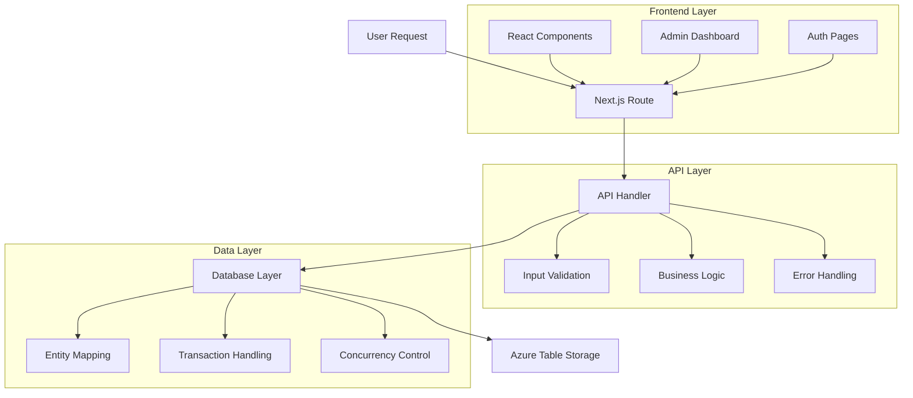

# H2All M1 - Developer Contribution Guide

## 🚀 TL;DR

**Quick Dev Setup:**

1. `git clone` → `npm install` → `cp .env.example .env.local` → `npm run dev`
2. **Start Here**: [Admin Dashboard](http://localhost:3000/admin) for system overview
3. **API Testing**: [Swagger UI](http://localhost:3000/admin/api-docs) + [Test Suite](http://localhost:3000/test-redemption-api.html)
4. **Key Files**: `src/app/api/` (endpoints), `src/types/` (interfaces), `src/lib/` (utilities)
5. **Before PR**: Run `npm run lint`, `npm run type-check`, test critical flows

---

## 📋 Developer Overview

H2All M1 is a Next.js 15.4.5 application built with React 19, TypeScript, and Azure Table Storage. This guide covers everything developers need to contribute effectively to the codebase.

### **Tech Stack Deep Dive**

- **Frontend**: Next.js App Router with React 19 and React Bootstrap 5
- **Backend**: API Routes with TypeScript and Azure Table Storage
- **Database**: Azure Data Tables with optimistic concurrency control
- **Authentication**: Custom email/password system with session management
- **Testing**: Interactive HTML test suites and automated validation
- **Documentation**: OpenAPI 3.0 with Swagger UI integration

---

## 🏗️ Architecture Overview

### **Project Structure**

```
src/
├── app/                          # Next.js App Router
│   ├── page.tsx                 # Landing page
│   ├── track/page.tsx           # Email collection
│   ├── impact/page.tsx          # Impact confirmation
│   ├── funded/page.tsx          # Project funding page
│   ├── login/page.tsx           # User authentication
│   ├── register/page.tsx        # User registration
│   ├── admin/                   # Administrative interface
│   │   ├── page.tsx            # Admin dashboard
│   │   ├── campaigns/page.tsx   # Campaign management
│   │   ├── codes/page.tsx       # Code management
│   │   ├── users/page.tsx       # User management
│   │   ├── data/page.tsx        # Analytics and exports
│   │   └── api-docs/page.tsx    # Swagger documentation
│   └── api/                     # API endpoints
│       ├── campaigns/           # Campaign CRUD + validation/redemption
│       ├── redemption-codes/    # Code generation and listing
│       ├── users/              # User management
│       ├── login/              # Authentication
│       ├── register/           # User registration
│       ├── health/             # System health check
│       ├── test/               # Database connectivity test
│       └── swagger/            # API documentation endpoint
├── types/                       # TypeScript definitions
│   ├── campaign.ts             # Campaign interfaces
│   ├── redemption.ts           # Redemption code interfaces
│   └── user.ts                 # User interfaces
├── lib/                        # Utility libraries
│   ├── database.ts             # Azure Table Storage client
│   ├── swagger.ts              # OpenAPI schema definition
│   └── utils/                  # Helper functions
└── components/                 # Reusable React components
```

### **Data Flow Architecture**



---

## 🛠️ Development Environment Setup

### **Prerequisites**

- **Node.js**: 18.0.0 or higher
- **npm**: 8.0.0 or higher (or yarn/pnpm/bun)
- **Git**: For version control
- **VS Code**: Recommended editor with extensions
- **Azure Account**: For Table Storage (optional for local dev)

### **Initial Setup**

```bash
# Clone the repository
git clone https://github.com/Larouex/h2All_m1_proto.git
cd h2All_m1_proto/h2all-m1

# Install dependencies
npm install

# Set up environment variables
cp .env.example .env.local

# Configure Azure Storage (optional)
# Add your Azure Storage connection string to .env.local
# AZURE_STORAGE_CONNECTION_STRING=DefaultEndpointsProtocol=https;...

# Start development server
npm run dev
```

### **Environment Variables**

```bash
# .env.local
AZURE_STORAGE_CONNECTION_STRING=your_azure_connection_string
NEXTAUTH_SECRET=your_nextauth_secret
NEXTAUTH_URL=http://localhost:3000
```

### **VS Code Configuration**

The project includes VS Code settings for optimal development:

```json
// .vscode/settings.json
{
  "typescript.preferences.importModuleSpecifier": "relative",
  "editor.formatOnSave": true,
  "editor.codeActionsOnSave": {
    "source.fixAll.eslint": true
  }
}
```

**Recommended Extensions:**

- TypeScript and JavaScript Language Features
- ESLint
- Prettier - Code formatter
- Azure Storage
- REST Client

---

## 📚 API Development Guide

### **API Route Structure**

All API routes follow Next.js App Router conventions in `src/app/api/`:

```typescript
// Example: src/app/api/campaigns/route.ts
import { NextRequest, NextResponse } from "next/server";

export async function GET(request: NextRequest) {
  try {
    // Implementation
    return NextResponse.json({ success: true, data });
  } catch (error) {
    return NextResponse.json(
      { success: false, error: error.message },
      { status: 500 }
    );
  }
}
```

### **Database Integration**

Azure Table Storage integration is handled through `src/lib/database.ts`:

```typescript
import { TableClient } from "@azure/data-tables";

// Get table client
const campaignsClient = getTableClient("campaigns");

// Create entity
await campaignsClient.createEntity(entity);

// List entities with filter
const entities = campaignsClient.listEntities({
  filter: `PartitionKey eq 'campaigns' and isActive eq true`,
});

// Update with concurrency control
await campaignsClient.updateEntity(entity, "Merge", {
  etag: entity.etag,
});
```

### **Error Handling Patterns**

```typescript
try {
  // Business logic
  const result = await someOperation();
  return NextResponse.json({ success: true, data: result });
} catch (error) {
  console.error("Operation failed:", error);

  if (error instanceof ValidationError) {
    return NextResponse.json(
      { success: false, error: error.message },
      { status: 400 }
    );
  }

  return NextResponse.json(
    { success: false, error: "Internal server error" },
    { status: 500 }
  );
}
```

### **TypeScript Integration**

All API responses use strict typing:

```typescript
// src/types/api.ts
interface ApiResponse<T> {
  success: boolean;
  data?: T;
  error?: string;
}

// Usage in API route
export async function GET(): Promise<NextResponse<ApiResponse<Campaign[]>>> {
  const campaigns = await getCampaigns();
  return NextResponse.json({ success: true, data: campaigns });
}
```

---

## 🗄️ Database Schema and Operations

### **Entity Structures**

#### **Campaign Entity**

```typescript
interface Campaign {
  partitionKey: string; // 'campaigns'
  rowKey: string; // Unique campaign ID
  id: string; // Same as rowKey
  name: string; // Campaign name
  description: string; // Campaign description
  isActive: boolean; // Active status
  startDate: string; // ISO date string
  endDate: string; // ISO date string
  redemptionValue: number; // Dollar value
  maxRedemptions: number; // Maximum allowed redemptions
  currentRedemptions: number; // Current redemption count
  createdAt: string; // ISO date string
  updatedAt: string; // ISO date string
  etag?: string; // For optimistic concurrency
}
```

#### **Redemption Code Entity**

```typescript
interface RedemptionCode {
  partitionKey: string; // Campaign ID
  rowKey: string; // Unique code ID
  id: string; // Same as rowKey
  code: string; // 8-character unique code
  campaignId: string; // Associated campaign
  isRedeemed: boolean; // Redemption status
  redeemedBy?: string; // User email who redeemed
  redeemedAt?: string; // ISO date string
  expiresAt: string; // ISO date string
  createdAt: string; // ISO date string
  etag?: string; // For optimistic concurrency
}
```

#### **User Entity**

```typescript
interface User {
  partitionKey: string; // 'users'
  rowKey: string; // User ID
  id: string; // Same as rowKey
  email: string; // Unique email address
  passwordHash: string; // Hashed password
  firstName: string; // User's first name
  lastName: string; // User's last name
  isActive: boolean; // Account status
  balance: number; // Current balance from redemptions
  lastLogin?: string; // ISO date string
  registrationDate: string; // ISO date string
  etag?: string; // For optimistic concurrency
}
```

### **Database Operations Patterns**

#### **Create Operations**

```typescript
async function createCampaign(
  campaignData: Partial<Campaign>
): Promise<Campaign> {
  const id = `${Date.now()}-${generateRandomString()}`;
  const entity: Campaign = {
    partitionKey: "campaigns",
    rowKey: id,
    id,
    ...campaignData,
    createdAt: new Date().toISOString(),
    updatedAt: new Date().toISOString(),
  };

  await campaignsClient.createEntity(entity);
  return entity;
}
```

#### **Read Operations with Filtering**

```typescript
async function getActiveCampaigns(): Promise<Campaign[]> {
  const entities = campaignsClient.listEntities<Campaign>({
    filter: `PartitionKey eq 'campaigns' and isActive eq true`,
  });

  const campaigns: Campaign[] = [];
  for await (const entity of entities) {
    campaigns.push(entity);
  }
  return campaigns;
}
```

#### **Update Operations with Concurrency Control**

```typescript
async function updateCampaign(
  id: string,
  updates: Partial<Campaign>
): Promise<Campaign> {
  const existing = await campaignsClient.getEntity<Campaign>("campaigns", id);

  const updated = {
    ...existing,
    ...updates,
    updatedAt: new Date().toISOString(),
  };

  await campaignsClient.updateEntity(updated, "Merge", {
    etag: existing.etag,
  });

  return updated;
}
```

#### **Transaction Operations**

```typescript
async function redeemCode(
  campaignId: string,
  code: string,
  userEmail: string
): Promise<RedemptionResult> {
  // Use optimistic concurrency for atomic operations
  const codeEntity = await getCodeEntity(campaignId, code);
  const userEntity = await getUserEntity(userEmail);

  if (codeEntity.isRedeemed) {
    throw new Error("Code already redeemed");
  }

  // Update code
  await codesClient.updateEntity(
    {
      ...codeEntity,
      isRedeemed: true,
      redeemedBy: userEmail,
      redeemedAt: new Date().toISOString(),
    },
    "Merge",
    { etag: codeEntity.etag }
  );

  // Update user balance
  await usersClient.updateEntity(
    {
      ...userEntity,
      balance: userEntity.balance + campaignEntity.redemptionValue,
    },
    "Merge",
    { etag: userEntity.etag }
  );

  return { success: true, redemptionValue: campaignEntity.redemptionValue };
}
```

---

## 🔐 Authentication System

### **Authentication Flow**

The application uses a custom email/password authentication system:

1. **Registration**: Create user account with hashed password
2. **Login**: Validate credentials and create session
3. **Session Management**: Track user state across requests
4. **Authorization**: Protect admin routes and API endpoints

### **Password Security**

```typescript
import bcrypt from "bcryptjs";

// Hash password during registration
const saltRounds = 12;
const passwordHash = await bcrypt.hash(password, saltRounds);

// Verify password during login
const isValid = await bcrypt.compare(password, user.passwordHash);
```

### **Session Management**

```typescript
// Create session after successful login
const session = {
  userId: user.id,
  email: user.email,
  isActive: true,
  createdAt: new Date().toISOString(),
};

// Store session in secure cookie or database
```

### **API Protection**

```typescript
async function authenticateUser(request: NextRequest): Promise<User | null> {
  const authHeader = request.headers.get("authorization");
  if (!authHeader) return null;

  // Validate session token and return user
  return await validateSessionToken(authHeader);
}

// Protect API routes
export async function POST(request: NextRequest) {
  const user = await authenticateUser(request);
  if (!user) {
    return NextResponse.json(
      { success: false, error: "Authentication required" },
      { status: 401 }
    );
  }

  // Continue with authenticated request
}
```

---

## 🧪 Testing and Quality Assurance

### **Testing Strategy**

The application includes multiple levels of testing:

1. **Unit Tests**: Individual function and component testing
2. **Integration Tests**: API endpoint validation
3. **End-to-End Tests**: Complete user flow validation
4. **Performance Tests**: Load and stress testing

### **Available Testing Tools**

#### **Interactive Test Suite**

```html
<!-- test-redemption-api.html -->
<script>
  async function runAllTests() {
    const tests = [
      testValidRedemption,
      testInvalidCampaign,
      testInvalidCode,
      testUnauthenticatedRedemption,
      testAlreadyRedeemedCode,
      testExpiredCampaign,
      testConcurrentRedemption,
      testConcurrentDifferentCodes,
    ];

    for (const test of tests) {
      await test();
    }
  }
</script>
```

#### **API Health Checks**

```typescript
// src/app/api/health/route.ts
export async function GET() {
  const checks = {
    database: await checkDatabaseConnection(),
    apiEndpoints: await checkCriticalEndpoints(),
    systemMetrics: await getSystemMetrics(),
  };

  return NextResponse.json({
    status: "healthy",
    timestamp: new Date().toISOString(),
    checks,
  });
}
```

### **Code Quality Standards**

#### **ESLint Configuration**

```json
{
  "extends": ["next/core-web-vitals", "@typescript-eslint/recommended"],
  "rules": {
    "@typescript-eslint/no-unused-vars": "error",
    "@typescript-eslint/explicit-function-return-type": "warn",
    "prefer-const": "error"
  }
}
```

#### **TypeScript Configuration**

```json
{
  "compilerOptions": {
    "strict": true,
    "noImplicitReturns": true,
    "noFallthroughCasesInSwitch": true,
    "exactOptionalPropertyTypes": true
  }
}
```

### **Pre-Commit Checklist**

```bash
# Run before every commit
npm run lint              # ESLint checks
npm run type-check        # TypeScript validation
npm run build            # Production build test
npm run test             # Run test suite (when available)
```

---

## 🚀 Performance Optimization

### **Code Generation Performance**

The system can generate 1M+ unique codes per second:

```typescript
import { nanoid } from "nanoid";

async function generateCodes(quantity: number): Promise<string[]> {
  const codes: string[] = [];
  const batchSize = 1000;

  for (let i = 0; i < quantity; i += batchSize) {
    const batch = Array.from(
      { length: Math.min(batchSize, quantity - i) },
      () => nanoid(8).toUpperCase()
    );
    codes.push(...batch);
  }

  return codes;
}
```

### **Database Optimization**

#### **Efficient Querying**

```typescript
// Use specific filters to reduce data transfer
const entities = campaignsClient.listEntities({
  filter: `PartitionKey eq 'campaigns' and isActive eq true`,
  select: ["id", "name", "redemptionValue"], // Only fetch needed fields
});
```

#### **Batch Operations**

```typescript
async function batchCreateCodes(codes: RedemptionCode[]): Promise<void> {
  const batchSize = 100;

  for (let i = 0; i < codes.length; i += batchSize) {
    const batch = codes.slice(i, i + batchSize);
    const transaction = [];

    for (const code of batch) {
      transaction.push(["create", code]);
    }

    await codesClient.submitTransaction(transaction);
  }
}
```

### **Frontend Optimization**

#### **Next.js Optimizations**

- **Static Generation**: Pre-render admin pages where possible
- **Code Splitting**: Automatic route-based splitting
- **Image Optimization**: Use Next.js Image component
- **Bundle Analysis**: Regular bundle size monitoring

#### **React Optimizations**

```typescript
import { memo, useMemo, useCallback } from "react";

const CampaignList = memo(({ campaigns }: { campaigns: Campaign[] }) => {
  const sortedCampaigns = useMemo(
    () => campaigns.sort((a, b) => a.name.localeCompare(b.name)),
    [campaigns]
  );

  const handleCampaignClick = useCallback((id: string) => {
    // Handle click
  }, []);

  return (
    <div>
      {sortedCampaigns.map((campaign) => (
        <div key={campaign.id} onClick={() => handleCampaignClick(campaign.id)}>
          {campaign.name}
        </div>
      ))}
    </div>
  );
});
```

---

## 🔒 Security Best Practices

### **Input Validation**

```typescript
import { z } from "zod";

const CampaignSchema = z.object({
  name: z.string().min(3).max(100),
  description: z.string().max(500),
  redemptionValue: z.number().min(1).max(1000),
  maxRedemptions: z.number().min(1).max(1000000),
});

export async function POST(request: NextRequest) {
  const body = await request.json();

  try {
    const validatedData = CampaignSchema.parse(body);
    // Continue with validated data
  } catch (error) {
    return NextResponse.json(
      { success: false, error: "Invalid input data" },
      { status: 400 }
    );
  }
}
```

### **SQL Injection Prevention**

Azure Table Storage uses parameterized queries by default, but always validate filters:

```typescript
// Safe filtering
const filter = `PartitionKey eq @partitionKey and isActive eq @isActive`;
const entities = client.listEntities({
  filter,
  parameters: {
    partitionKey: "campaigns",
    isActive: true,
  },
});
```

### **Authentication Security**

```typescript
// Secure password requirements
const PasswordSchema = z
  .string()
  .min(8, "Password must be at least 8 characters")
  .regex(/[A-Z]/, "Password must contain uppercase letter")
  .regex(/[a-z]/, "Password must contain lowercase letter")
  .regex(/[0-9]/, "Password must contain number")
  .regex(/[^A-Za-z0-9]/, "Password must contain special character");
```

### **Rate Limiting**

```typescript
const rateLimiter = new Map();

function checkRateLimit(
  ip: string,
  maxRequests = 100,
  windowMs = 60000
): boolean {
  const now = Date.now();
  const requests = rateLimiter.get(ip) || [];

  // Remove expired requests
  const validRequests = requests.filter(
    (time: number) => now - time < windowMs
  );

  if (validRequests.length >= maxRequests) {
    return false;
  }

  validRequests.push(now);
  rateLimiter.set(ip, validRequests);
  return true;
}
```

---

## 📖 API Documentation Standards

### **OpenAPI Schema Definition**

All APIs are documented using OpenAPI 3.0 in `src/lib/swagger.ts`:

```typescript
export const swaggerSpec: OpenAPIV3.Document = {
  openapi: "3.0.0",
  info: {
    title: "H2All M1 API",
    version: "1.0.0",
    description: "Campaign and Redemption System API",
  },
  paths: {
    "/api/campaigns": {
      get: {
        summary: "List all campaigns",
        responses: {
          "200": {
            description: "Successful response",
            content: {
              "application/json": {
                schema: {
                  $ref: "#/components/schemas/CampaignListResponse",
                },
              },
            },
          },
        },
      },
    },
  },
  components: {
    schemas: {
      Campaign: {
        type: "object",
        properties: {
          id: { type: "string" },
          name: { type: "string" },
          description: { type: "string" },
        },
      },
    },
  },
};
```

### **JSDoc Comments**

````typescript
/**
 * Creates a new campaign with validation and error handling
 * @param campaignData - The campaign data to create
 * @returns Promise resolving to the created campaign
 * @throws {ValidationError} When campaign data is invalid
 * @throws {DatabaseError} When database operation fails
 * @example
 * ```typescript
 * const campaign = await createCampaign({
 *   name: 'Summer Sale',
 *   redemptionValue: 25,
 *   maxRedemptions: 1000
 * });
 * ```
 */
async function createCampaign(
  campaignData: Partial<Campaign>
): Promise<Campaign> {
  // Implementation
}
````

---

## 🔄 Contribution Workflow

### **Git Workflow**

```bash
# Create feature branch
git checkout -b feature/add-campaign-analytics

# Make changes with descriptive commits
git commit -m "feat: add campaign analytics dashboard"
git commit -m "test: add analytics API tests"
git commit -m "docs: update API documentation"

# Push and create pull request
git push origin feature/add-campaign-analytics
```

### **Commit Message Convention**

Follow Conventional Commits specification:

```
type(scope): description

Types:
- feat: New feature
- fix: Bug fix
- docs: Documentation changes
- style: Code style changes
- refactor: Code refactoring
- test: Adding or updating tests
- chore: Maintenance tasks

Examples:
feat(api): add campaign expiration validation
fix(auth): resolve session timeout issue
docs(readme): update setup instructions
test(redemption): add concurrent redemption tests
```

### **Pull Request Checklist**

- [ ] **Code Quality**: ESLint and TypeScript checks pass
- [ ] **Testing**: All existing tests pass, new tests added for new features
- [ ] **Documentation**: API documentation updated if needed
- [ ] **Performance**: No performance regressions introduced
- [ ] **Security**: Security best practices followed
- [ ] **Backward Compatibility**: Changes don't break existing functionality

### **Code Review Guidelines**

#### **What to Review**

- **Logic**: Algorithm correctness and edge case handling
- **Security**: Input validation and authentication
- **Performance**: Efficiency and scalability considerations
- **Maintainability**: Code clarity and documentation
- **Testing**: Test coverage and quality

#### **Review Feedback Format**

```markdown
**Issue**: Brief description of the problem
**Severity**: Critical/High/Medium/Low
**Suggestion**: Specific recommendation for improvement
**Example**: Code example if applicable
```

---

## 🐛 Debugging and Troubleshooting

### **Common Issues and Solutions**

#### **Database Connection Issues**

```typescript
// Check connection health
async function validateDatabaseConnection(): Promise<boolean> {
  try {
    const client = getTableClient("campaigns");
    await client.getEntity("campaigns", "test-connection");
    return true;
  } catch (error) {
    console.error("Database connection failed:", error);
    return false;
  }
}
```

#### **Authentication Problems**

```typescript
// Debug authentication flow
async function debugAuth(request: NextRequest): Promise<void> {
  const authHeader = request.headers.get("authorization");
  console.log("Auth header:", authHeader);

  if (authHeader) {
    const user = await validateSession(authHeader);
    console.log("Authenticated user:", user?.email || "None");
  }
}
```

#### **Performance Issues**

```typescript
// Monitor API response times
async function withTiming<T>(
  operation: () => Promise<T>,
  operationName: string
): Promise<T> {
  const start = Date.now();
  try {
    const result = await operation();
    const duration = Date.now() - start;
    console.log(`${operationName} completed in ${duration}ms`);
    return result;
  } catch (error) {
    const duration = Date.now() - start;
    console.error(`${operationName} failed after ${duration}ms:`, error);
    throw error;
  }
}
```

### **Debugging Tools**

#### **VS Code Debugging Configuration**

```json
// .vscode/launch.json
{
  "version": "0.2.0",
  "configurations": [
    {
      "name": "Next.js: debug server-side",
      "type": "node",
      "request": "launch",
      "program": "${workspaceFolder}/node_modules/next/dist/bin/next",
      "args": ["dev"],
      "cwd": "${workspaceFolder}",
      "runtimeExecutable": null,
      "runtimeArgs": ["--inspect"],
      "port": 9229,
      "serverReadyAction": {
        "pattern": "started server on .*, url: (https?://.*)$",
        "uriFormat": "%s",
        "action": "debugWithChrome"
      }
    }
  ]
}
```

#### **Browser DevTools**

- **Network Tab**: Monitor API requests and responses
- **Console**: Check for JavaScript errors and logs
- **Application Tab**: Inspect local storage and cookies
- **Performance Tab**: Analyze rendering and script execution

### **Logging Best Practices**

```typescript
// Structured logging
interface LogEntry {
  level: "info" | "warn" | "error";
  message: string;
  timestamp: string;
  context?: Record<string, any>;
}

function log(
  level: LogEntry["level"],
  message: string,
  context?: Record<string, any>
): void {
  const entry: LogEntry = {
    level,
    message,
    timestamp: new Date().toISOString(),
    context,
  };

  console.log(JSON.stringify(entry));
}

// Usage
log("info", "Campaign created successfully", { campaignId: "camp-123" });
log("error", "Database connection failed", { error: error.message });
```

---

## 📊 Monitoring and Analytics

### **Performance Monitoring**

```typescript
// API performance tracking
class PerformanceMonitor {
  private static metrics = new Map<string, number[]>();

  static trackApiCall(endpoint: string, duration: number): void {
    const existing = this.metrics.get(endpoint) || [];
    existing.push(duration);

    // Keep only last 100 measurements
    if (existing.length > 100) {
      existing.shift();
    }

    this.metrics.set(endpoint, existing);
  }

  static getAverageResponseTime(endpoint: string): number {
    const measurements = this.metrics.get(endpoint) || [];
    return measurements.length > 0
      ? measurements.reduce((a, b) => a + b) / measurements.length
      : 0;
  }
}
```

### **Error Tracking**

```typescript
// Centralized error handling
class ErrorTracker {
  static async reportError(
    error: Error,
    context: Record<string, any>
  ): Promise<void> {
    const errorReport = {
      message: error.message,
      stack: error.stack,
      timestamp: new Date().toISOString(),
      context,
    };

    // Log locally
    console.error("Error reported:", errorReport);

    // Send to monitoring service (if configured)
    // await sendToMonitoringService(errorReport);
  }
}
```

### **Business Metrics**

```typescript
// Track business KPIs
interface BusinessMetrics {
  campaignsCreated: number;
  codesGenerated: number;
  redemptionsCompleted: number;
  userRegistrations: number;
  averageRedemptionValue: number;
}

async function getBusinessMetrics(): Promise<BusinessMetrics> {
  const [campaigns, codes, redemptions, users] = await Promise.all([
    getCampaignCount(),
    getCodeCount(),
    getRedemptionCount(),
    getUserCount(),
  ]);

  return {
    campaignsCreated: campaigns,
    codesGenerated: codes,
    redemptionsCompleted: redemptions,
    userRegistrations: users,
    averageRedemptionValue: await getAverageRedemptionValue(),
  };
}
```

---

## 🔗 Additional Resources

### **Development Tools**

- **[Admin Dashboard](http://localhost:3000/admin)** - Complete system overview
- **[API Documentation](http://localhost:3000/admin/api-docs)** - Interactive Swagger UI
- **[Test Suite](http://localhost:3000/test-redemption-api.html)** - Comprehensive API testing
- **[System Health](http://localhost:3000/api/health)** - Real-time system status

### **External Documentation**

- **[Next.js Documentation](https://nextjs.org/docs)** - Framework reference
- **[Azure Table Storage](https://docs.microsoft.com/en-us/azure/storage/tables/)** - Database documentation
- **[TypeScript Handbook](https://www.typescriptlang.org/docs/)** - Language reference
- **[React Bootstrap](https://react-bootstrap.github.io/)** - UI component library

### **Community and Support**

- **GitHub Issues**: [Repository Issues](https://github.com/Larouex/h2All_m1_proto/issues)
- **Code Reviews**: Pull request discussions
- **Documentation**: Inline code documentation and README files

---

## 📝 Appendix

### **Useful Code Snippets**

#### **Environment Configuration Check**

```typescript
function validateEnvironment(): void {
  const required = ["AZURE_STORAGE_CONNECTION_STRING"];
  const missing = required.filter((key) => !process.env[key]);

  if (missing.length > 0) {
    throw new Error(`Missing environment variables: ${missing.join(", ")}`);
  }
}
```

#### **Type-Safe Environment Variables**

```typescript
interface Environment {
  AZURE_STORAGE_CONNECTION_STRING: string;
  NEXTAUTH_SECRET: string;
  NEXTAUTH_URL: string;
}

function getEnv(): Environment {
  return {
    AZURE_STORAGE_CONNECTION_STRING:
      process.env.AZURE_STORAGE_CONNECTION_STRING!,
    NEXTAUTH_SECRET: process.env.NEXTAUTH_SECRET!,
    NEXTAUTH_URL: process.env.NEXTAUTH_URL!,
  };
}
```

#### **Database Entity Helper**

```typescript
function createEntity<T extends Record<string, any>>(
  partitionKey: string,
  data: Omit<T, "partitionKey" | "rowKey" | "id" | "createdAt" | "updatedAt">
): T {
  const id = `${Date.now()}-${nanoid(8)}`;
  const now = new Date().toISOString();

  return {
    partitionKey,
    rowKey: id,
    id,
    ...data,
    createdAt: now,
    updatedAt: now,
  } as T;
}
```

---

**🚀 Happy coding! Build amazing features for H2All M1!**
