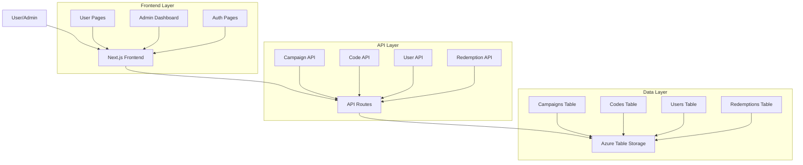
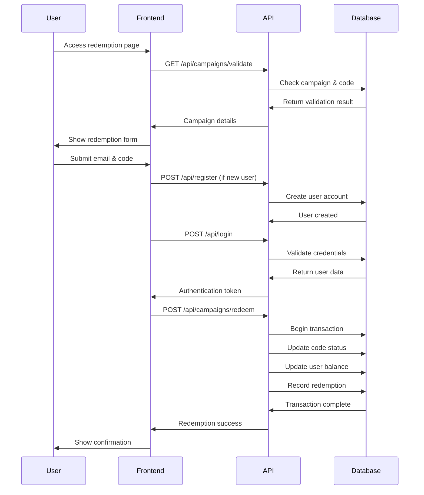
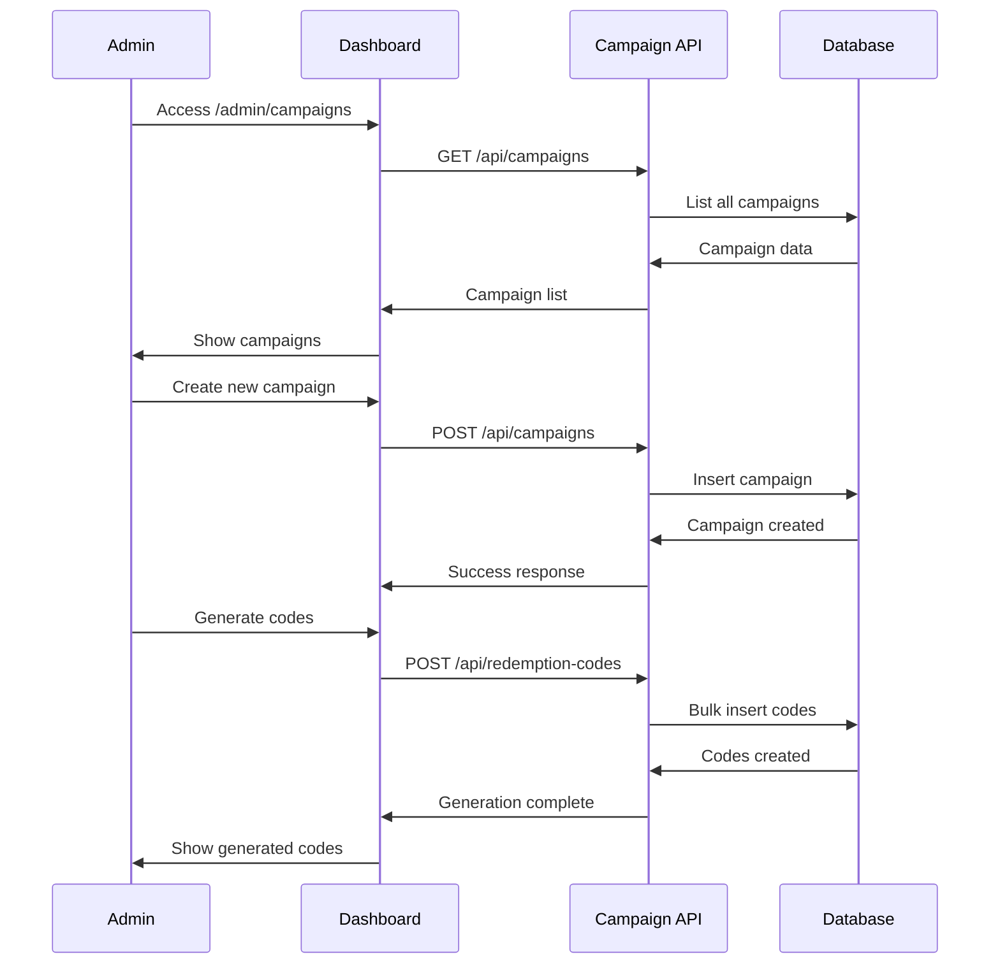

# H2All M1 - Comprehensive Testing Guide

## 🚀 TL;DR

**Pre-Release Testing Checklist:**

1. **API Health Check** → **Campaign Creation** → **Code Generation** → **User Registration** → **Code Redemption** → **Analytics Validation**
2. **Critical Paths**: Authentication flow, concurrent redemption safety, campaign lifecycle, admin dashboard functionality
3. **Tools**: [Interactive Test Suite](http://localhost:3000/test-redemption-api.html), [API Health](http://localhost:3000/api/health), [Admin Dashboard](http://localhost:3000/admin)
4. **Success Criteria**: All 8 automated test scenarios pass + manual end-to-end flows complete successfully

---

## 📋 Testing Overview

This guide provides comprehensive end-to-end testing procedures for H2All M1 before production releases. The testing strategy covers API functionality, user flows, admin operations, and system reliability.

### **Testing Scope**

- ✅ **API Endpoints**: All CRUD operations and business logic
- ✅ **User Authentication**: Registration, login, and session management
- ✅ **Campaign Lifecycle**: Creation, activation, code generation, and redemption
- ✅ **Admin Dashboard**: All management interfaces and operations
- ✅ **Data Integrity**: Concurrent operations and transaction safety
- ✅ **Performance**: Response times and system capacity
- ✅ **Security**: Input validation and authentication flows

---

## 🏗️ System Architecture Flow



---

## 🔄 Critical User Flows

### **1. Complete Redemption Flow**



### **2. Admin Campaign Management Flow**



---

## 🧪 Automated Test Suite

### **Interactive Testing Interface**

**Access**: [http://localhost:3000/test-redemption-api.html](http://localhost:3000/test-redemption-api.html)

### **Test Scenarios Overview**

| Test # | Scenario                                | Expected Result             | Critical Path |
| ------ | --------------------------------------- | --------------------------- | ------------- |
| 1      | Valid user redemption                   | ✅ Success + balance update | 🔥 Critical   |
| 2      | Invalid campaign ID                     | ❌ Campaign not found error | 🔥 Critical   |
| 3      | Invalid redemption code                 | ❌ Code not found error     | 🔥 Critical   |
| 4      | Unauthenticated redemption              | ❌ Authentication required  | 🔥 Critical   |
| 5      | Already redeemed code                   | ❌ Code already used error  | 🔥 Critical   |
| 6      | Expired campaign                        | ❌ Campaign expired error   | ⚠️ Important  |
| 7      | Concurrent redemption (same code)       | ❌ Only one succeeds        | 🔥 Critical   |
| 8      | Concurrent redemption (different codes) | ✅ Both succeed             | 🔥 Critical   |

### **Automated Test Execution**

```javascript
// Example Test Runner Function
async function runAllTests() {
  const results = [];

  // Test 1: Valid Redemption
  results.push(await testValidRedemption());

  // Test 2: Invalid Campaign
  results.push(await testInvalidCampaign());

  // Test 3-8: Additional scenarios...

  return results;
}
```

---

## 📝 Manual Testing Procedures

### **Pre-Release Testing Checklist**

#### **🏁 Phase 1: System Health Check**

- [ ] **API Health**: Visit [/api/health](http://localhost:3000/api/health)
- [ ] **Database Connectivity**: Visit [/api/test](http://localhost:3000/api/test)
- [ ] **Admin Dashboard**: Access [/admin](http://localhost:3000/admin)
- [ ] **API Documentation**: Load [/admin/api-docs](http://localhost:3000/admin/api-docs)

#### **🎯 Phase 2: Campaign Management Testing**

##### **Campaign Creation**

1. Navigate to [Campaign Manager](http://localhost:3000/admin/campaigns)
2. Click "Create New Campaign"
3. Fill out campaign details:
   ```
   Name: Test Campaign Release 2025
   Description: Pre-release validation campaign
   Redemption Value: $25
   Max Redemptions: 100
   Start Date: Current date
   End Date: +30 days
   ```
4. **Verify**: Campaign appears in list with "Draft" status
5. **Activate**: Change status to "Active"
6. **Verify**: Campaign status updates successfully

##### **Code Generation**

1. Navigate to [Code Manager](http://localhost:3000/admin/codes)
2. Select the test campaign
3. Generate codes:
   ```
   Quantity: 50
   Code Length: 8 characters
   ```
4. **Verify**: Codes generate successfully (should complete in <5 seconds)
5. **Verify**: Codes appear in code list with "Available" status
6. **Export**: Download generated codes as CSV

#### **🔐 Phase 3: Authentication Flow Testing**

##### **User Registration**

1. Open incognito/private browser window
2. Navigate to [/register](http://localhost:3000/register)
3. Register new test user:
   ```
   Email: test-user-release@example.com
   Password: TestPassword123!
   First Name: Test
   Last Name: User
   ```
4. **Verify**: Registration successful
5. **Verify**: User redirected to appropriate page
6. **Verify**: User appears in [User Management](http://localhost:3000/admin/users)

##### **User Login**

1. Logout if logged in
2. Navigate to [/login](http://localhost:3000/login)
3. Login with test credentials
4. **Verify**: Login successful
5. **Verify**: User session persists across page refreshes

#### **🎫 Phase 4: Code Redemption Testing**

##### **Valid Code Redemption**

1. Use test user account from Phase 3
2. Navigate to redemption page
3. Enter valid campaign ID and unused code
4. Complete redemption flow
5. **Verify**: Code marked as "Redeemed"
6. **Verify**: User balance updated correctly
7. **Verify**: Redemption recorded in admin dashboard

##### **Error Handling**

1. **Invalid Code**: Test with non-existent code
   - **Expected**: "Code not found" error
2. **Reused Code**: Test with already redeemed code
   - **Expected**: "Code already used" error
3. **Unauthenticated**: Test without login
   - **Expected**: "Authentication required" error

#### **⚡ Phase 5: Concurrent Testing**

##### **Race Condition Testing**

1. Open 2 browser windows
2. Login with same user in both
3. Attempt to redeem same code simultaneously
4. **Verify**: Only one redemption succeeds
5. **Verify**: No duplicate balance updates
6. **Verify**: Code status correctly updated

##### **Performance Testing**

1. Generate 1000+ codes
2. Measure generation time
3. **Expected**: <10 seconds for 1000 codes
4. Test bulk code redemption
5. Monitor API response times
6. **Expected**: <500ms average response time

#### **📊 Phase 6: Admin Dashboard Validation**

##### **Analytics Verification**

1. Navigate to [Data Management](http://localhost:3000/admin/data)
2. **Verify**: Campaign statistics accurate
3. **Verify**: User registration counts correct
4. **Verify**: Redemption analytics match actual redemptions
5. **Export**: Download analytics data
6. **Verify**: Exported data format and completeness

##### **User Management**

1. Navigate to [User Management](http://localhost:3000/admin/users)
2. **Verify**: Test user appears in list
3. **Verify**: User details accurate
4. **Verify**: Activity tracking functional
5. **Test**: User status toggle (activate/deactivate)

---

## 🔍 Security Testing

### **Authentication Security**

#### **Password Security**

- [ ] **Weak Passwords**: Rejected appropriately
- [ ] **Password Hashing**: Verify passwords not stored in plain text
- [ ] **Session Management**: Sessions expire appropriately
- [ ] **Brute Force Protection**: Rate limiting on login attempts

#### **API Security**

- [ ] **Input Validation**: Invalid inputs rejected
- [ ] **SQL Injection**: Parameterized queries used
- [ ] **CORS Settings**: Proper cross-origin policies
- [ ] **Error Handling**: No sensitive data in error messages

### **Business Logic Security**

#### **Code Redemption Security**

- [ ] **Double Redemption**: Prevented via database constraints
- [ ] **Code Guessing**: Cryptographically secure generation
- [ ] **Campaign Boundaries**: Codes only work for intended campaigns
- [ ] **Expiration Handling**: Expired codes properly rejected

---

## 📊 Performance Testing

### **Load Testing Scenarios**

#### **API Performance Benchmarks**

| Endpoint                   | Expected Response Time | Acceptable Load |
| -------------------------- | ---------------------- | --------------- |
| GET /api/campaigns         | <200ms                 | 100 req/sec     |
| POST /api/campaigns/redeem | <500ms                 | 50 req/sec      |
| POST /api/redemption-codes | <5000ms (1000 codes)   | 10 req/sec      |
| GET /api/users             | <300ms                 | 25 req/sec      |

#### **Database Performance**

- [ ] **Connection Pool**: Verify efficient connection usage
- [ ] **Query Performance**: Monitor slow queries
- [ ] **Concurrent Operations**: Test multiple simultaneous operations
- [ ] **Transaction Integrity**: Verify ACID properties maintained

### **Stress Testing**

#### **Code Generation Stress Test**

1. Generate 10,000 codes in single request
2. **Monitor**: Memory usage and response time
3. **Expected**: Complete within 30 seconds
4. **Verify**: All codes unique and properly formatted

#### **Concurrent Redemption Stress Test**

1. Simulate 50 simultaneous redemption attempts
2. **Monitor**: Database locks and transaction times
3. **Verify**: No deadlocks or data corruption
4. **Verify**: All redemptions processed correctly

---

## 🔄 End-to-End Test Automation

### **Automated Test Script Example**

```bash
#!/bin/bash
# Pre-Release Automated Test Script

echo "🚀 Starting H2All M1 Pre-Release Testing..."

# Health Checks
echo "📊 Phase 1: Health Checks"
curl -f http://localhost:3000/api/health || exit 1
curl -f http://localhost:3000/api/test || exit 1

# Campaign Creation
echo "🎯 Phase 2: Campaign Testing"
CAMPAIGN_ID=$(curl -X POST http://localhost:3000/api/campaigns \
  -H "Content-Type: application/json" \
  -d '{"name":"Auto Test Campaign","redemptionValue":25,"maxRedemptions":100}' \
  | jq -r '.id')

echo "Created campaign: $CAMPAIGN_ID"

# Code Generation
echo "🎫 Phase 3: Code Generation"
curl -X POST http://localhost:3000/api/redemption-codes \
  -H "Content-Type: application/json" \
  -d "{\"campaignId\":\"$CAMPAIGN_ID\",\"quantity\":10}" || exit 1

# User Registration
echo "🔐 Phase 4: User Testing"
curl -X POST http://localhost:3000/api/register \
  -H "Content-Type: application/json" \
  -d '{"email":"autotest@example.com","password":"TestPass123!","firstName":"Auto","lastName":"Test"}' || exit 1

echo "✅ All automated tests passed!"
```

---

## 📋 Test Documentation Templates

### **Test Case Template**

```markdown
## Test Case: [Test Name]

**Test ID**: TC-001
**Priority**: High/Medium/Low
**Category**: API/UI/Integration/Performance

### Objective

Brief description of what this test validates

### Prerequisites

- List of conditions required before test execution
- Test data requirements
- System state requirements

### Test Steps

1. Step 1 description
2. Step 2 description
3. Continue...

### Expected Results

- What should happen at each step
- Final expected outcome

### Actual Results

[To be filled during test execution]

### Pass/Fail Criteria

Clear criteria for determining test success

### Notes

Any additional observations or comments
```

### **Bug Report Template**

```markdown
## Bug Report: [Issue Title]

**Bug ID**: BUG-001
**Severity**: Critical/High/Medium/Low
**Priority**: P1/P2/P3/P4
**Status**: Open/In Progress/Resolved/Closed

### Environment

- Browser/Platform:
- Application Version:
- Test Environment URL:

### Steps to Reproduce

1. Step 1
2. Step 2
3. Continue...

### Expected Behavior

What should have happened

### Actual Behavior

What actually happened

### Screenshots/Logs

[Attach relevant evidence]

### Workaround

[If available]

### Additional Notes

[Any other relevant information]
```

---

## 🎯 Release Criteria

### **Critical Success Metrics**

#### **Functional Requirements**

- [ ] **100% Pass Rate**: All critical test scenarios pass
- [ ] **API Stability**: No 5xx errors in normal operations
- [ ] **Data Integrity**: All transactions complete successfully
- [ ] **Authentication**: Login/logout flows work correctly
- [ ] **Campaign Lifecycle**: Complete CRUD operations functional

#### **Performance Requirements**

- [ ] **Response Times**: Meet or exceed benchmark targets
- [ ] **Concurrency**: Handle expected user load without degradation
- [ ] **Code Generation**: 1M+ codes/second capability maintained
- [ ] **Database Performance**: Query times within acceptable limits

#### **Security Requirements**

- [ ] **Authentication**: Proper session management
- [ ] **Authorization**: Appropriate access controls
- [ ] **Input Validation**: All user inputs properly validated
- [ ] **Error Handling**: No sensitive data exposure

### **Pre-Release Sign-off Checklist**

- [ ] **QA Lead**: All test scenarios executed and documented
- [ ] **Development Lead**: Code review and security audit complete
- [ ] **Product Manager**: Business requirements validated
- [ ] **DevOps**: Infrastructure and deployment verified
- [ ] **Stakeholder**: Final approval for release

---

## 🛠️ Testing Tools and Resources

### **Available Testing Interfaces**

- **[Interactive Test Suite](http://localhost:3000/test-redemption-api.html)** - Comprehensive API testing
- **[Admin Dashboard](http://localhost:3000/admin)** - Manual testing interface
- **[API Documentation](http://localhost:3000/admin/api-docs)** - Swagger UI for API testing
- **[System Health](http://localhost:3000/api/health)** - Real-time system status

### **Recommended Testing Tools**

- **Postman**: API testing and automation
- **Browser DevTools**: Network and performance analysis
- **Azure Portal**: Database monitoring and analytics
- **Lighthouse**: Performance and accessibility auditing

### **Test Data Management**

- **Test Users**: Create dedicated test accounts
- **Test Campaigns**: Use clearly named test campaigns
- **Code Generation**: Generate specific test code sets
- **Data Cleanup**: Remove test data after completion

---

## 📞 Support and Escalation

### **Testing Issues Contact**

- **Technical Issues**: Check system health endpoints first
- **Test Failures**: Document with screenshots and logs
- **Performance Issues**: Include response time measurements
- **Data Issues**: Provide specific examples and timestamps

### **Emergency Escalation**

- **Critical Failures**: Immediately halt release process
- **Security Issues**: Escalate to security team
- **Data Corruption**: Backup and restore procedures
- **System Outage**: Incident response protocols

---

**🎯 Remember: Thorough testing ensures reliable releases and user satisfaction!**
